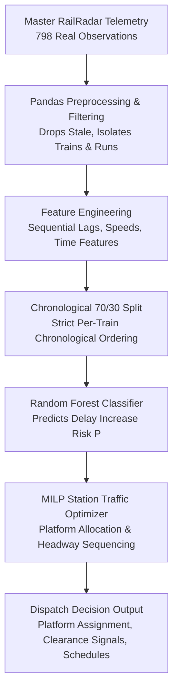

# Nexora End-to-End ML & Train Traffic Optimization Pipeline

## 1. System Architecture & Flow

The Nexora Prototype demonstrates a complete, closed-loop intelligent train dispatching and platform allocation pipeline:



---

## 2. Optimization Layer Mathematical Formulation

The optimization engine (`src/railradar/optimization.py`) solves a multi-train station platform assignment and headway scheduling problem:

### Parameters & Inputs
- $N$: Set of active approaching trains $i \in \{1, \dots, N\}$.
- $M$: Number of available platform tracks $p \in \{1, \dots, M\}$.
- $a_i$: Planned approach/arrival time of train $i$ (minutes).
- $w_i$: Scheduled dwell time at station platform (minutes, default 2.0 min).
- $h$: Minimum headway separation between successive train movements on the same platform (minutes, default 2.0 min).
- $\text{Priority}_i$: Operational service priority (Superfast Mail = 3.0, Fast Local = 2.0, Slow Local = 1.0).
- $P_i$: ML-predicted probability of delay increase from Random Forest Classifier $P(\text{delay\_increase}_i \mid X_i) \in [0, 1]$.

### Decision Variables
- $s_i \ge a_i$: Actual scheduled entry / arrival start time of train $i$ at station platform.
- $x_{i, p} \in \{0, 1\}$: Binary platform assignment variable ($1$ if train $i$ is assigned to platform $p$).
- $z_{i, j} \in \{0, 1\}$: Binary precedence variable for pair $(i, j)$ with $i < j$ ($1$ if train $i$ precedes train $j$).
- $d_i = s_i - a_i \ge 0$: Station hold delay incurred by train $i$.

### Objective Function
Minimize total weighted holding penalty and delay risk:
$$\min \sum_{i=1}^N \left[ \text{Priority}_i \times (1 + 2 \cdot P_i) \times d_i \right] + 0.001 \sum_{i=1}^N s_i$$

### Constraints
1. **Platform Exclusivity**: Each train must be assigned to exactly one platform:
   $$\sum_{p=1}^M x_{i, p} = 1, \quad \forall i \in \{1, \dots, N\}$$

2. **Arrival Feasibility**: No train can enter before its physical corridor arrival time:
   $$s_i \ge a_i, \quad \forall i \in \{1, \dots, N\}$$

3. **Collision Avoidance & Headway Spacing**: If trains $i$ and $j$ are assigned to the same platform $p$ ($x_{i, p} = x_{j, p} = 1$), they must not overlap and must observe headway $h$:
   - If train $i$ departs first ($z_{i, j} = 1$):
     $$s_j \ge s_i + w_i + h - \text{BigM} \cdot (2 - x_{i, p} - x_{j, p}) - \text{BigM} \cdot (1 - z_{i, j})$$
   - If train $j$ departs first ($z_{i, j} = 0$):
     $$s_i \ge s_j + w_j + h - \text{BigM} \cdot (2 - x_{i, p} - x_{j, p}) - \text{BigM} \cdot z_{i, j}$$

---

## 3. Sample Execution Output

Below is an actual run on 5 Central Line suburban trains approaching a 2-platform station:

```text
================================================================================
NEXORA: END-TO-END ML & TRAIN TRAFFIC OPTIMIZATION PIPELINE
================================================================================

[Stage 1/5] Executing Pandas Preprocessing on Master CSV...
  [OK] Master Observations Processed: 798
  [OK] Stale Observations Excluded: 293
  [OK] Valid ML-Ready Sequential Observations: 470
  [OK] Unique Trains: 30 | Unique Stations: 36

[Stage 2/5] Training Random Forest Regressor (target: target_delay_change)...
  [OK] Zero-Change Baseline Test: MAE = 0.8129, RMSE = 1.5862, R2 = -0.0011
  [OK] Random Forest Regressor Test: MAE = 0.9457, RMSE = 1.6622, R2 = -0.0992

[Stage 3/5] Training Random Forest Classifier (target: delay_increase)...
  [OK] Majority Baseline Test: Acc = 0.8258, F1 = 0.0
  [OK] RF Classifier Test: Acc = 0.6129, Precision = 0.2105, Recall = 0.4444, F1 = 0.2857

[Stage 4/5] Exporting Top Feature Importances...
  [OK] Top 5 Predictive Features:
    1. delay_change_prev                      : 8.39% importance
    2. delay_minutes                          : 6.85% importance
    3. distance_from_origin_km                : 6.85% importance
    4. train_number                           : 6.85% importance
    5. time_since_previous_observation_seconds : 6.47% importance

[Stage 5/5] Running MILP Station Platform & Dispatch Optimization...
  [OK] Solver Status: OPTIMAL (Backend: scipy_milp)
  [OK] Total Weighted Delay Penalty: 7.6727
  [OK] Total Station Hold Delay: 4.0 minutes

  Optimized Platform & Dispatch Schedule:
  --------------------------------------------------------------------------------------------------------------
  Plat   Arr(m)   Dep(m)   Hold(m)  Train No   Train Name                       Risk     Action Note
  --------------------------------------------------------------------------------------------------------------
  P1    0.00     2.00     0.00     95327      A51 / Mumbai CSMT - Ambernath    0.45     Direct clear entry to Platform 1.
  P2    1.50     3.50     0.00     95515      AN25 / Mumbai CSMT - Asangaon    0.36     Direct clear entry to Platform 2.
  P1    4.00     6.00     1.00     95733      K103 AC / Mumbai CSMT - Kalyan   0.47     Held 1.0m at outer signal for Platform 1 clearance.
  P2    5.50     7.50     1.00     97399      T103 / Mumbai CSMT - Thane Loc   0.47     Held 1.0m at outer signal for Platform 2 clearance.
  P1    8.00     10.00    2.00     97401      T107 / Mumbai CSMT - Thane Slo   0.44     Held 2.0m at outer signal for Platform 1 clearance.
  --------------------------------------------------------------------------------------------------------------
```

---

## 4. How to Run the Pipeline (100% Offline)

```bash
# Run the complete end-to-end pipeline script
python scripts/run_end_to_end_pipeline.py

# Run the complete test suite (53 unit tests)
pytest
```
